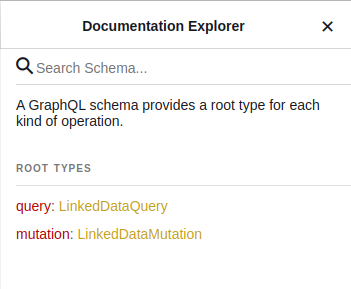
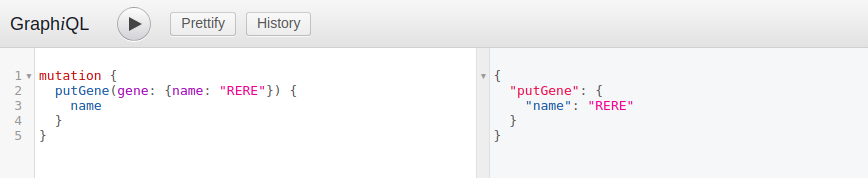
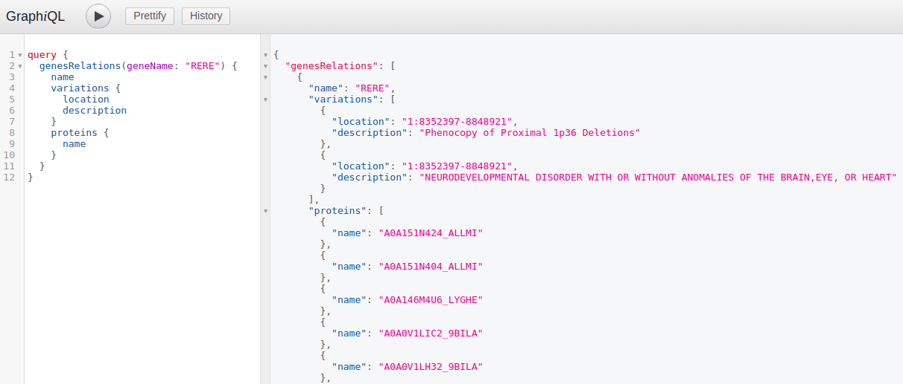

# Linked Data
Vertical integration of metagenomic data.

## Technologies
- .NET Core 3.0
- ASP.NET Core
- GraphQL 2.4.0
- Neo4j 3.5.3

## Usage
The application must be available at:
[https://{hostname}:5000/graphql](https://{hostname}:5000/graphql)

GraphQL schema info on the right side of the screen:

Add gene example:

Get gene and it's proteins info example:

